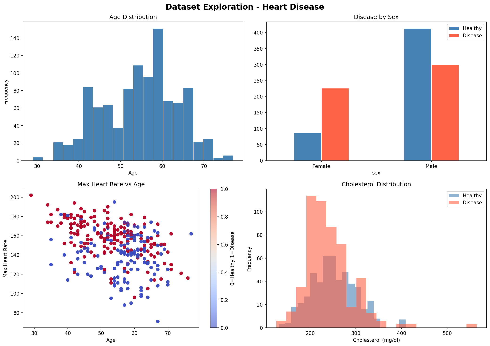
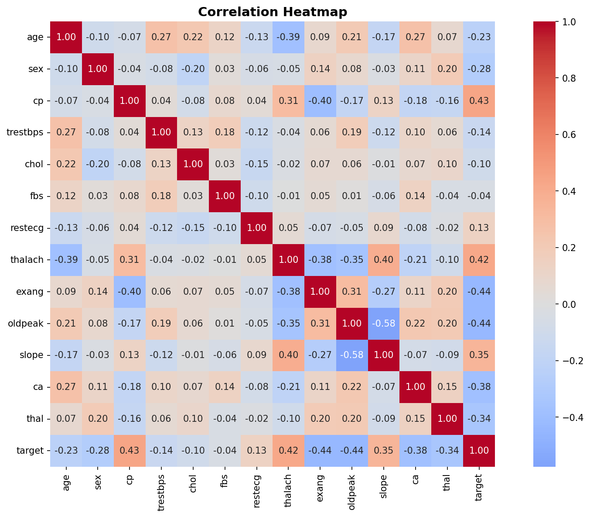
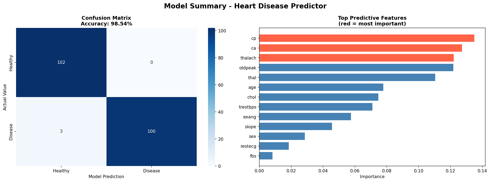

# Heart Disease Predictor
**Estefanía Marcel** · Advanced astronomy student, FCAGLP-UNLP
 


 
A machine learning project to predict heart disease presence using clinical data.
Built as part of my Data Science portfolio.
 
---
 
## Overview
 
This project applies exploratory data analysis and a Random Forest classifier
to predict whether a patient has heart disease, achieving **98.54% accuracy**
on the test set.
 
---
 
## Dataset
 
* **Source:** [Heart Disease Dataset - Kaggle](https://www.kaggle.com/datasets/johnsmith88/heart-disease-dataset)
* **Size:** 1,025 patients, 14 clinical variables
* **Target:** Binary classification (0 = healthy, 1 = disease)
---
 
## Key Findings
 
* Most predictive variables: **chest pain type (cp)**, **number of major vessels (ca)**, and **max heart rate (thalach)**
* Cholesterol, surprisingly, showed minimal predictive power
* Dataset is well balanced (51.3% disease / 48.7% healthy)
* Female patients in this dataset tend to be more frequently diagnosed with disease, though they are underrepresented in the data
---
 
## Results
 
| Metric | Score |
| --- | --- |
| Accuracy | 98.54% |
| Precision (disease) | 1.00 |
| Recall (disease) | 0.97 |
| F1-score | 0.99 |
 
---
 
## Visualizations
 
### Exploratory Analysis

 
### Correlation Heatmap

 
### Feature Importance & Model Summary

 
---
 
## Tech Stack
 
* Python 3.11
* pandas, numpy
* matplotlib, seaborn
* scikit-learn
---
 
## How to Run
 
```bash
pip install pandas numpy matplotlib seaborn scikit-learn
jupyter notebook Heart_disease_analysis/heart_disease_analysis.ipynb
```
 
---
 
## About
 
Advanced Astronomy student at FCAGLP-UNLP (Argentina), specializing in X-ray astrophysics and high-energy sources. This project was developed as a self-taught exploration of machine learning and data science, driven by genuine interest in expanding my skills beyond my core research area.
 
[GitHub](https://github.com/tefimarcel)
